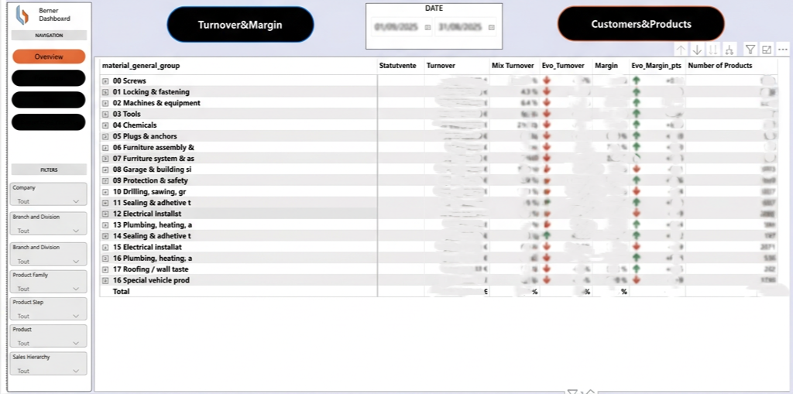
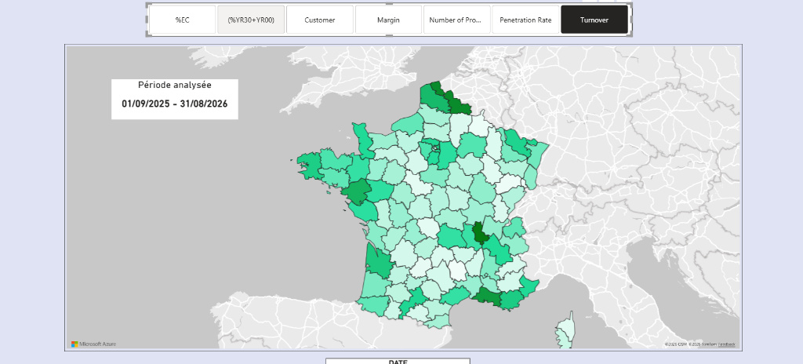

## Contexte & Problématique

Au sein du service **Data Marketing & Pricing** chez BERNER, les suivis de performance des gammes produits reposaient sur des fichiers Excel volumineux (outil *BofEx*). Ces processus présentaient plusieurs limites critiques :
* **Volume de données & Lenteur** : Traitements manuels lourds et ralentissements importants sur les fichiers de plus de 100 000 lignes.
* **Absence d'interactivité** : Analyse statique générant un « tunnel de vision » et restreignant l'exploration approfondie des ventes.
* **Obsolescence temporelle** : Mises à jour manuelles séquencées sans source unique et uniformisée.

## Solution développée

Pour résoudre ces contraintes, j'ai conçu et déployé une solution décisionnelle automatisée sous **Power BI**, alimentée par des requêtes SQL optimisées.

### Architecture & Fonctionnalités clés
* **Suivi de la performance globale** : Analyse croisée du chiffre d'affaires, de la marge, du mix produit et des évolutions d'une année sur l'autre (YoY) par groupe de matériel.
* **Analyse géographique & Pénétration** : Visualisation cartographique par département pour évaluer le taux de pénétration et la couverture client[cite: 11].
* **Suivi temporel & Tendances** : Graphiques dynamiques d'évolution mensuelle permettant d'isoler les variations par indicateur et par trimestre[cite: 12].
* **Filtres & Segmentation** : Navigation multi-critères par filiale, famille de produits, canal de vente et hiérarchie commerciale[cite: 10].

## Comparatif technique : Excel vs Power BI

| Fonctionnalité | Ancienne approche (Excel / BofEx) | Solution déployée (Power BI) |
| :--- | :--- | :--- |
| **Volume de données** | Limité (lenteur > 100k lignes) | Traitement de données massives sans perte de fluide |
| **Interactivité** | Filtres basiques et visuels statiques | Graphiques dynamiques et filtres croisés |
| **Partage** | Fichiers isolés par utilisateur | Source unique, uniformisée et sécurisée |
| **Mises à jour** | Séquencées et manuelles | Automatisation du flux de données |

## Impact & Livrables

* **Présentation CODIR / Future Youth** : Présentation du projet et démonstration de l'outil devant la direction le 15 juillet 2026.
* **Adoption métier** : Outil mis à disposition des Spécialistes Produit et du service Promotion à la rentrée 2026, accompagné de sessions de formation.
* **Gain de productivité** : Réduction drastique du temps d'extraction et suppression des tâches répétitives de préparation de données.